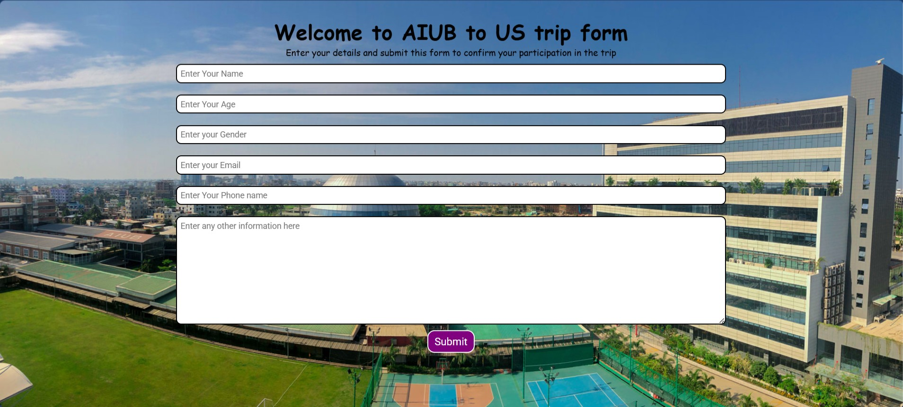

# Form Handling System

This is a **Travel Trip Registration Form** built with PHP and MySQL. It was created as part of an AIUB (American International University-Bangladesh) trip project.

## Preview

## Features

- Collects user details: Name, Age, Gender, Email, Phone, and additional information.
- Validates that all fields are filled before submission.
- Inserts the submitted data into a MySQL database table.
- Displays a success message after successful form submission.

## Files

| File | Description |
|------|-------------|
| `index.php` | Main PHP file containing both the form and the backend logic for database insertion |
| `style.css` | Stylesheet for the form UI |
| `index.js` | JavaScript file for front-end interactions |
| `form.png` | Screenshot/preview of the form |

## How It Works

1. The user fills in all required fields (Name, Age, Gender, Email, Phone, and Other info).
2. On form submission, PHP checks that no field is empty.
3. If all fields are valid, a MySQL connection is established and the data is inserted into the `aiubtrip.trip` table.
4. A success message is shown to the user after the data is stored.
5. If any field is missing, an error message prompts the user to fill all fields.

## Database

- **Database:** `aiubtrip`
- **Table:** `trip`
- **Columns:** `name`, `age`, `gender`, `email`, `phone`, `other`, `date`
